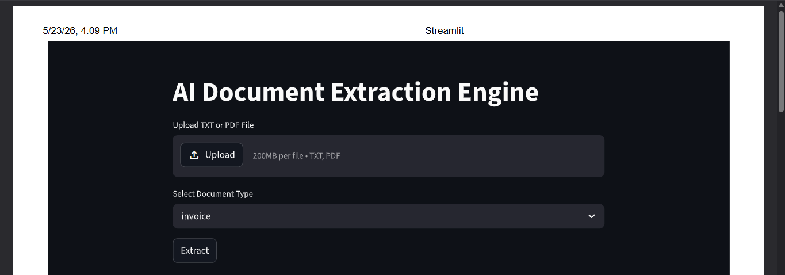
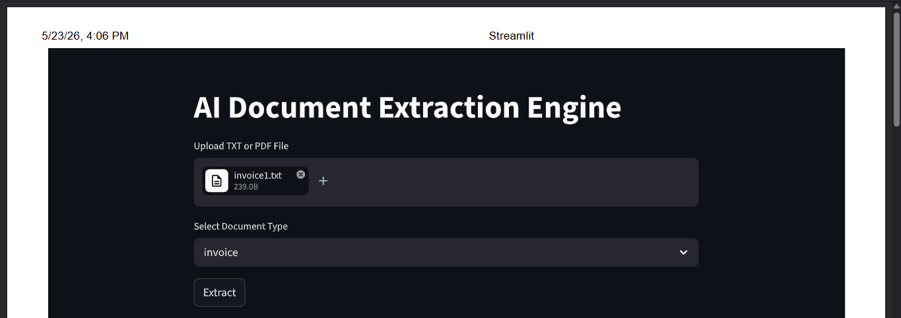
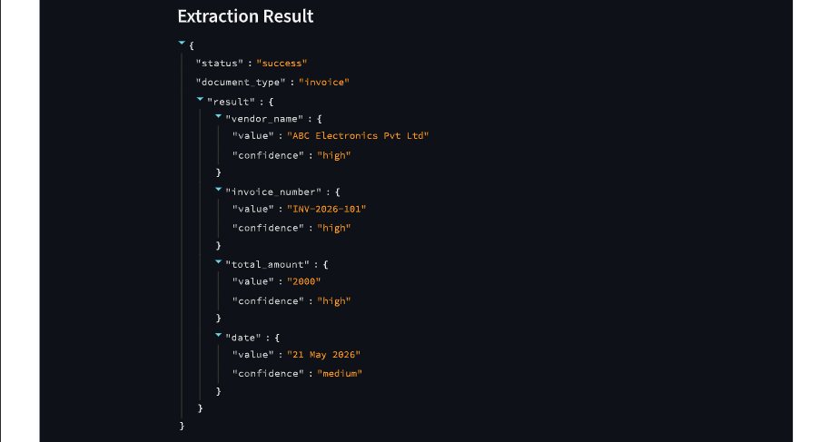
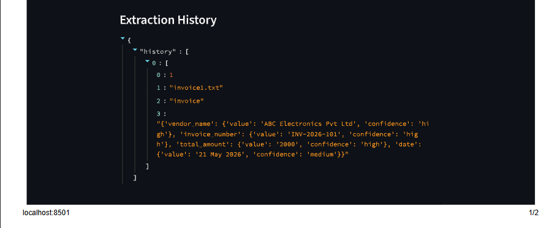
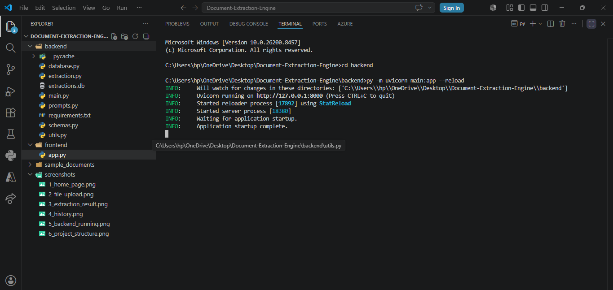
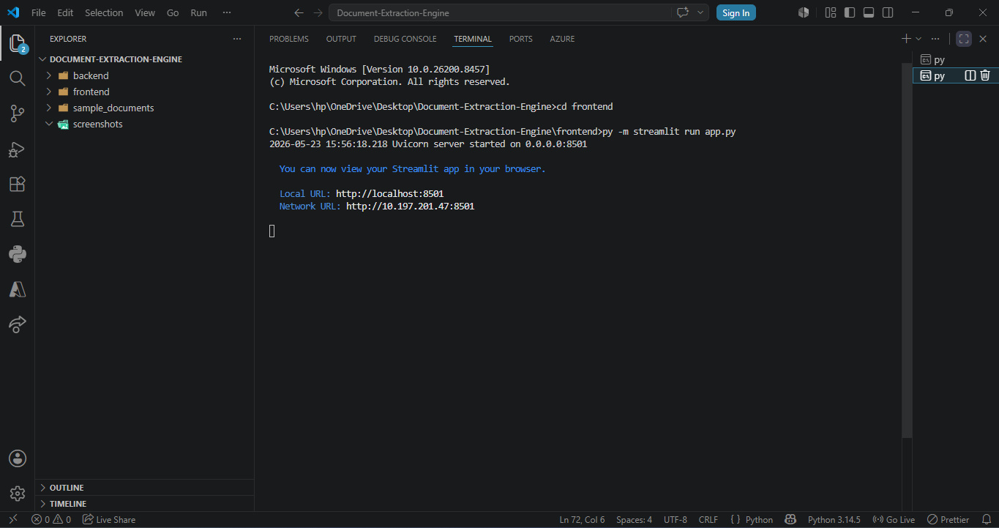

# Document-Extraction-Engine
AI-powered document extraction engine using FastAPI and Streamlit.

## Overview

AI Document Extraction Engine is a web-based application developed using FastAPI and Streamlit. The system allows users to upload TXT or PDF documents and automatically extract structured information such as invoice details and resume information.

The project demonstrates document parsing, structured JSON generation, confidence scoring, API integration, and database storage.

---

# Features

- Upload TXT and PDF documents
- Invoice data extraction
- Resume data extraction
- Structured JSON output
- Confidence score generation
- SQLite database integration
- Extraction history
- FastAPI backend
- Streamlit frontend
- Error handling

---

# Technologies Used

## Backend
- FastAPI
- Python
- SQLite

## Frontend
- Streamlit

## Libraries
- pdfplumber
- requests
- pydantic
- python-multipart

---

# Project Structure

Document-Extraction-Engine

├── backend
│   ├── main.py
│   ├── extraction.py
│   ├── utils.py
│   ├── prompts.py
│   ├── schemas.py
│   ├── database.py
│   ├── requirements.txt
│
├── frontend
│   ├── app.py
│
├── sample_documents
│   ├── invoice.txt
│
├── screenshots
│
└── README.md

---

# Screenshots

## Home Page

## File Upload

## Extraction Result

## Extraction History

## Backend Running

## Project Structure

# Future Improvements

- OCR support
- AI-based extraction
- Cloud deployment
- User authentication
- CSV/Excel export
- Multi-language support

# Author

Prakash Kumar

B.Tech CSE

Sikkim Manipal Institute of Technology
